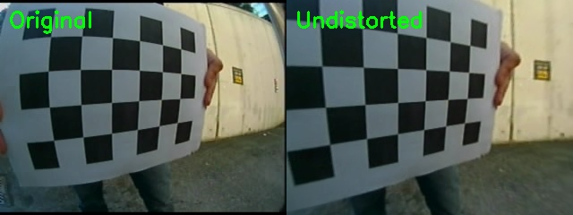
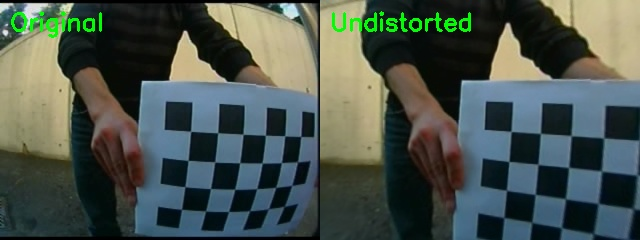

# OpenCV 相机标定工具 (Camera Calibration Tool)

基于 OpenCV 实现的相机标定程序，使用张正友标定法（Zhang's method）。支持 C++ 和 Python 双版本，可计算相机内参、畸变系数，并通过 PnP 算法求解相机外参。

## 功能特点

- **自动检测**：自动检测棋盘格角点，支持亚像素级精度优化
- **内参标定**：计算相机内参矩阵（焦距、主点）和畸变系数（径向 + 切向）
- **外参计算**：基于地面棋盘格，使用 PnP 算法计算相机在世界坐标系中的位姿（旋转矩阵、平移向量、欧拉角）
- **结果保存**：内参与外参分别保存为 XML 文件，方便后续读取
- **效果验证**：提供去畸变（Undistort）的可视化对比功能
- **双版本**：C++ 与 Python 实现功能等价，可根据环境选择

## 依赖项

| 语言 | 依赖 |
|------|------|
| C++ | CMake >= 3.10, C++14, OpenCV 3.x/4.x |
| Python | Python 3, `opencv-python`, `numpy` |

Python 依赖安装：

```bash
pip install opencv-python numpy
```

## 编译与运行

### C++ 版本

```bash
mkdir build && cd build
cmake .. && make -j$(nproc)
./camera_calibration
```

### Python 版本

```bash
python3 camera_calibration.py
```

两种方式都支持手动指定图片路径：

```bash
./camera_calibration image1.jpg image2.jpg   # C++
python3 camera_calibration.py image1.jpg image2.jpg   # Python
```

## 图片准备

### 内参标定图片

将棋盘格照片放入 `calibration_images/` 文件夹，文件命名格式为 `chessboard01.jpg`, `chessboard02.jpg` …（两位数字编号）。

- 建议拍摄 15–40 张不同角度的图片
- 默认棋盘参数：**内角点 6×4**，方格大小 **30mm**
- 如需修改参数，编辑源码中的 `boardSize` 和 `squareSize` 变量

### 外参计算图片（PnP）

将用于外参计算的地面棋盘格照片放入 `extrinsic_images/` 文件夹，命名规则同上（`chessboard01.jpg`, `chessboard02.jpg` …）。

- 外参计算独立于内参标定，图片从单独文件夹加载
- 棋盘格应平放在地面上，程序会依次计算每张图片对应的相机外参

## 输出结果

### 内参标定结果（`camera_calibration_result.xml`）

运行结束后生成，包含：

| 字段 | 说明 |
|------|------|
| `calibration_time` | 标定时间 |
| `image_width` / `image_height` | 图像分辨率 |
| `camera_matrix` | 相机内参矩阵 (3×3) |
| `distortion_coefficients` | 畸变系数 ($k_1, k_2, p_1, p_2, k_3$) |
| `rms_reprojection_error` | 重投影误差 RMS（像素） |

### 外参计算结果（`camera_extrinsic_result.xml`）

包含每张外参图像的旋转向量、平移向量、旋转矩阵和相机在世界坐标系中的位置。

## 实际标定结果示例

使用 43 张 320×240 的棋盘格图片进行标定，40 张成功检测到角点。

### 内参

```
相机内参矩阵:
┌                      ┐
│ 207.91    0    159.59 │
│   0    222.14  119.97 │
│   0       0      1    │
└                      ┘

畸变系数:
k1 = -0.4120   k2 =  0.1361   p1 = -0.0024
p2 = -0.0087   k3 =  0.0048

重投影误差 RMS: 0.791 像素
```

### 外参（地面棋盘格 PnP）

以 `extrinsic_images/chessboard01.jpg` 为例：

```
旋转矩阵 R:
┌                        ┐
│  0.857   -0.034   -0.514 │
│ -0.067    0.982   -0.177 │
│  0.511    0.186    0.839 │
└                        ┘

平移向量 t (mm):    相机在世界坐标中的位置 (mm):
  tx = -80.58            Xc =  -5.71
  ty = -59.22            Yc =  29.66
  tz = 138.48            Zc = 168.12 (相机距地面高度)

欧拉角:
  偏航角 Yaw   = -4.5°
  俯仰角 Pitch = -30.7°
  翻滚角 Roll  =  12.5°
```

### 去畸变效果对比



*左：原始图像 &nbsp;&nbsp; 右：去畸变后*



## 注意事项

- C++ 与 Python 版本功能等价，修改棋盘参数或算法逻辑时需**同步更新两份代码**
- 内参标定至少需要 3 张成功检测到角点的图像
- 外参计算假设棋盘格平放在地面上（Z=0 平面即为地面）
- Python 版本在无图形会话环境（如 SSH）下会自动禁用 `imshow` 窗口
- 以下文件已加入 `.gitignore`，不应提交到仓库：`build/`、`*.xml`、`undistortion_results/`、`process.ipynb`、`__pycache__/`

## 项目结构

```
.
├── camera_calibration.cpp    # C++ 实现
├── camera_calibration.py     # Python 实现
├── CMakeLists.txt            # CMake 构建配置
├── AGENTS.md                 # Agent 开发指南
├── calibration_images/       # 内参标定图像（43张）
├── extrinsic_images/         # 外参计算图像
├── docs/                     # 文档配图
└── .gitignore
```
